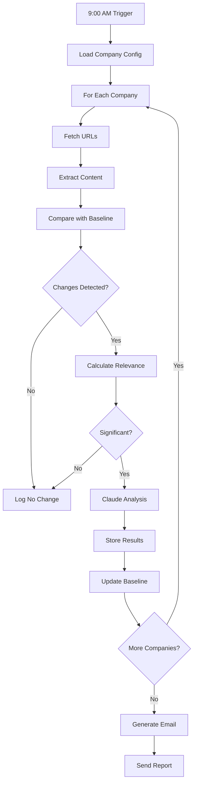

# System Architecture

This document explains the technical architecture and design of the AI Competitor Intelligence Monitor.

## 🏗️ System Overview

```
┌─────────────────┐     ┌──────────────────┐     ┌─────────────────┐
│                 │     │                  │     │                 │
│  Google Apps    │────▶│  Web Scraping    │────▶│  Claude AI      │
│  Script Engine  │     │  & Extraction    │     │  Analysis       │
│                 │     │                  │     │                 │
└────────┬────────┘     └──────────────────┘     └────────┬────────┘
         │                                                  │
         │              ┌──────────────────┐                │
         │              │                  │                │
         └─────────────▶│  Google Sheets   │◀───────────────┘
                        │  Data Storage    │
                        │                  │
                        └────────┬─────────┘
                                 │
                        ┌────────▼─────────┐
                        │                  │
                        │  Email Reports   │
                        │  (Gmail)         │
                        │                  │
                        └──────────────────┘
```

## 🔧 Core Components

### 1. Google Apps Script Engine

The backbone of the system, providing:

- **Execution Environment**: V8 JavaScript runtime
- **Triggers**: Time-based automation
- **API Hosting**: Web App deployment
- **Service Integration**: Native Google services

**Key Files:**
- `WebApp.gs` - HTTP API endpoints
- `ExecutionHandlers.gs` - Request routing
- `appsscript.json` - Manifest and permissions

### 2. Web Scraping Module

Fetches and extracts content from competitor websites.

**Components:**
```javascript
// Content extraction pipeline
URLFetch → HTML Parse → Text Extract → Clean → Hash
```

**Key Functions:**
- `extractPageContent()` - Main extraction logic
- `extractTextFromHtml()` - HTML to text conversion
- `identifyPageType()` - Content classification

**Features:**
- Respects robots.txt
- Handles redirects
- Error retry logic
- Content normalization

### 3. Change Detection System

Identifies meaningful changes between monitoring runs.

**Algorithm:**
1. Generate content hash
2. Compare with baseline
3. Calculate similarity score
4. Apply relevance filters
5. Flag significant changes

**Key Files:**
- `IntelligentMonitor.gs` - Core detection logic
- `MonitorStubs.gs` - Monitoring utilities

### 4. AI Analysis Engine

Uses Claude AI for intelligent insights.

**Integration Flow:**
```javascript
Change Detected → Format for Claude → API Call → Parse Response → Store Insights
```

**Key Components:**
- `ClaudeIntegration.gs` - API interface
- `analyzeContent()` - Content analysis
- `createAnalysisPrompt()` - Prompt engineering

**Claude Configuration:**
```javascript
{
  model: "claude-3-haiku-20240307",
  max_tokens: 1000,
  temperature: 0.3,
  system: "Competitive intelligence analyst"
}
```

### 5. Data Storage Layer

Google Sheets provides structured data storage.

**Sheet Structure:**
```
Monitor Sheet/
├── Changes/        # Detected changes log
├── Baseline/       # Current state snapshots
├── Summary/        # Statistics and metrics
├── Logs/          # System activity
├── Claude Analysis/# AI insights
└── Email Log/     # Sent emails tracking
```

**Data Schema:**

**Changes Tab:**
| Timestamp | Company | URL | Change Type | Content | Relevance | AI Summary |
|-----------|---------|-----|-------------|---------|-----------|------------|

**Baseline Tab:**
| Company | URL | Last Checked | Content Hash | Full Content |
|---------|-----|--------------|--------------|--------------|

### 6. Email Delivery System

Sends formatted HTML reports via Gmail.

**Email Pipeline:**
```
Monitoring Complete → Generate Report → Format HTML → Send via Gmail
```

**Key Files:**
- `DailyDigestEmail.gs` - Email templates
- `NotificationSystem.gs` - Alert logic

## 📊 Data Flow

### Daily Monitoring Flow



### API Request Flow

```
Client Request → Web App → Auth Check → Route → Execute → Response
                              ↓
                          [Rejected]
```

## 🔐 Security Architecture

### Authentication Layers

1. **API Token**: Simple bearer token
2. **Google Auth**: OAuth2 for services
3. **Script Properties**: Secure key storage

### Data Protection

- **In Transit**: HTTPS everywhere
- **At Rest**: Google's encryption
- **API Keys**: Never in code, always in properties

### Access Control

```javascript
// Web App execution
"executeAs": "USER_DEPLOYING"  // Runs as owner
"access": "ANYONE_ANONYMOUS"    // But requires token
```

## ⚡ Performance Optimization

### Caching Strategy

```javascript
// Three-tier caching
1. Memory Cache - Current execution (fastest)
2. Cache Service - Cross-execution (1 hour)
3. Google Sheets - Permanent storage (slowest)
```

### Batch Processing

```javascript
// Parallel URL fetching
const responses = UrlFetchApp.fetchAll(requests);

// Batch sheet writes
sheet.getRange(1, 1, data.length, data[0].length)
  .setValues(data);
```

### Rate Limiting

```javascript
// Protect against overuse
const limits = {
  urlFetch: 20000/day,
  email: 1500/day,
  claude: 100/hour
};
```

## 🔄 State Management

### Properties Service

Stores configuration and state:

```javascript
Script Properties/
├── monitorConfig      # Company configuration
├── CLAUDE_API_KEY     # AI service key
├── ownerEmail         # Email recipient
├── monitorSheetId     # Data storage
└── lastRunTime        # Execution tracking
```

### Trigger Management

```javascript
// Automated execution
Time-based Triggers/
├── runDailyMonitoringWithEmail - 9:00 AM daily
├── runPriorityCheck - 3:00 PM daily
└── generateWeeklySummary - Mondays 8:00 AM
```

## 🛠️ Extension Points

### Adding New Extractors

```javascript
// Custom extractor interface
function customExtractor(html, url, company) {
  return {
    content: extractedText,
    metadata: additionalInfo,
    confidence: 0.95
  };
}
```

### Adding New AI Models

```javascript
// AI provider interface
class AIProvider {
  async analyze(content, prompt) {
    // Implementation
  }
}
```

### Adding New Storage

```javascript
// Storage adapter interface
class StorageAdapter {
  async save(data) { }
  async retrieve(query) { }
}
```

## 📈 Scalability Considerations

### Current Limits

- **Companies**: ~50 comfortable limit
- **URLs/Company**: ~10 recommended
- **Execution Time**: 6 minutes max
- **Daily Runs**: Quota-dependent

### Scaling Strategies

1. **Horizontal**: Multiple script instances
2. **Batch Processing**: Split large jobs
3. **Async Operations**: Use triggers creatively
4. **External Services**: Offload heavy processing

## 🔍 Monitoring & Observability

### Built-in Monitoring

```javascript
// System health checks
- Execution logs in Sheets
- Error tracking and alerts
- Performance metrics
- Quota usage monitoring
```

### Debug Mode

```javascript
// Enable verbose logging
const DEBUG = PropertiesService.getScriptProperties()
  .getProperty('DEBUG_MODE') === 'true';

if (DEBUG) {
  console.time('Operation');
  // ... operation
  console.timeEnd('Operation');
}
```

## 🏗️ Deployment Architecture

### Development → Production

```
Local Development → Clasp Push → Script Editor → Deploy Web App → Production
                                        ↓
                                  Version Control
```

### Zero-Downtime Updates

1. Push new code
2. Test via execute endpoint
3. Create new deployment
4. Switch traffic
5. Monitor for issues

## 🔧 Technology Decisions

### Why Google Apps Script?

- **Free Infrastructure**: No servers to manage
- **Native Integration**: Gmail, Sheets built-in
- **Scheduled Execution**: Cron-like triggers
- **Simple Deployment**: One-click publish

### Why Claude AI?

- **Quality**: Superior analysis capabilities
- **API**: Clean, simple integration
- **Cost**: Reasonable for volume
- **Speed**: Fast response times

### Why Google Sheets?

- **Familiar Interface**: Users know it
- **Real-time Collaboration**: Share access
- **API**: Rich programmatic access
- **Visualization**: Charts and pivots

## 📐 Design Patterns

### Repository Pattern
```javascript
// Abstract data access
class CompanyRepository {
  save(company) { /* Sheets implementation */ }
  find(id) { /* Sheets implementation */ }
}
```

### Observer Pattern
```javascript
// Change notifications
class ChangeObserver {
  notify(change) {
    this.handlers.forEach(h => h(change));
  }
}
```

### Strategy Pattern
```javascript
// Pluggable extractors
class ExtractionStrategy {
  extract(html) { /* Override in subclass */ }
}
```

## 🚀 Future Architecture

### Potential Enhancements

1. **Multi-Model AI**: Support GPT-4, Gemini
2. **Webhook Support**: Real-time notifications
3. **API Gateway**: Rate limiting, analytics
4. **Data Pipeline**: Stream processing
5. **ML Integration**: Predictive analytics

### Migration Paths

- **To Cloud Functions**: For heavy processing
- **To Cloud Run**: For containerized deployment
- **To BigQuery**: For analytics at scale

---

The architecture prioritizes simplicity, reliability, and cost-effectiveness while providing powerful competitive intelligence capabilities.